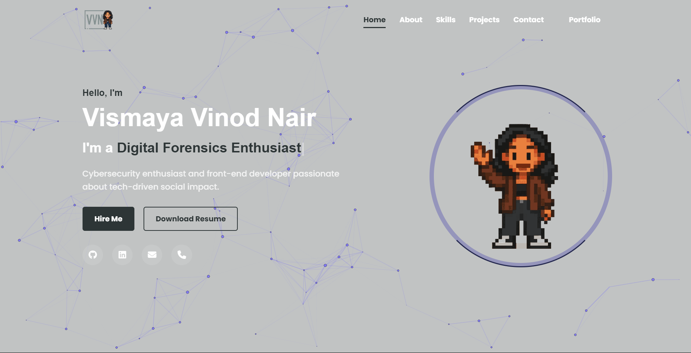

# Vismaya Vinod Nair - Portfolio Website

<h1 align="center">Hi, I'm Vismaya Vinod Nair 👩‍💻</h1>

Cybersecurity Enthusiast | Frontend Developer | B.Tech @ VIT Bhopal  

  <a href="https://vismaya2xx4.github.io/Vismaya-PORTFOLIO/" target="_blank">
    🔗 Visit My Portfolio
  </a>

---

## 🌟 About Me

- 🎓 B.Tech CSE (Cybersecurity & Digital Forensics) @ VIT Bhopal (2022–2026)
- 🔐 Passionate about cybersecurity, UI/UX, and secure web applications
- 👩‍💻 Strong in problem-solving and building impactful tech projects
- 🌍 Based in Kerala 🇮🇳 and Dubai 🇦🇪
- 💬 Languages: English, Malayalam, Hindi, Arabic, Tamil

---

## 💡 Skills & Tools

---

## 📫 Contact Me

---

## 🌐 Live Preview

Check out my full portfolio here:  
👉 https://vismaya2xx4.github.io/Vismaya-PORTFOLIO/

---

📝 “Security is not a product, but a process.” – Bruce Schneier

